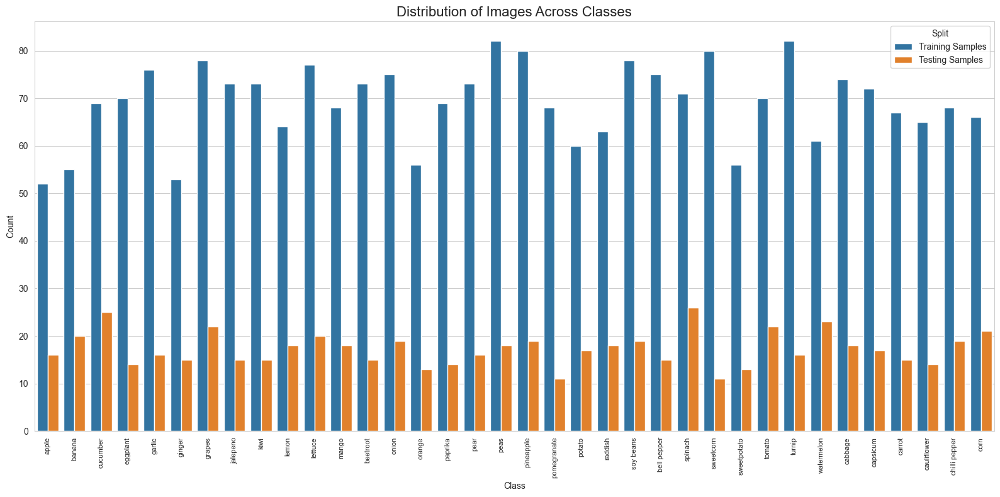

# Fruit Detection and Classification

### Dataset

The project uses the **Fruit and Vegetable Image Recognition** dataset from Hugging Face ([Nattakarn/fruit-and-vegetable-image-recognition](https://huggingface.co/datasets/Nattakarn/fruit-and-vegetable-image-recognition)). This comprehensive dataset includes multiple classes of fruits and vegetables in various conditions and environments.

**Dataset Statistics:**
- Total classes: 36 different fruits and vegetables
- Total images: ~3,100 
- Training images: ~2,500 (80%)
- Testing images: ~600 (20%)
- Image format: RGB (converted from various source formats)



### Data Preparation Pipeline

1. **Dataset Acquisition**:
   - Download the dataset using Hugging Face datasets library
   - Extract and organize images into train/test splits

2. **Data Preprocessing**:
   - Convert all images to RGB format for consistency
   - Organize into class-specific directories
   - Create label mapping for human-readable class names

3. **Dataset Analysis**:
   - Generate statistics on class distribution
   - Evaluate image characteristics (size, quality)
   - Identify potential class imbalance issues

### YOLO Implementation Workflow

1. **Dataset Formatting for YOLO**:
```
📁 complete_fruit_veg_dataset
├── 📁 train
│   ├── 📁 class_0 (apple) (52 files)
│   │   └── 📄 ... (52 files)
│   ├── 📁 class_1 (banana) (55 files)
│   │   └── 📄 ... (55 files)
│   ├── 📁 class_2 (beetroot) (73 files)
│   │   └── 📄 ... (73 files)
│   ├── 📁 class_3 (bell pepper) (75 files)
│   │   └── 📄 ... (75 files)
│   ├── 📁 class_4 (cabbage) (74 files)
│   │   └── 📄 ... (74 files)
│   └── 📁 ... (30 more classes)
└── 📁 test
    ├── 📁 class_0 (apple) (16 files)
    │   └── 📄 ... (16 files)
    ├── 📁 class_1 (banana) (20 files)
    │   └── 📄 ... (20 files)
    ├── 📁 class_2 (beetroot) (15 files)
    │   └── 📄 ... (15 files)
    ├── 📁 class_3 (bell pepper) (15 files)
    │   └── 📄 ... (15 files)
    ├── 📁 class_4 (cabbage) (18 files)
    │   └── 📄 ... (18 files)
    └── 📁 ... (30 more classes)
```

2. **Annotation Generation**:
   - Convert class directories to YOLO format annotations
   - Generate `.txt` files with format: `<class> <x_center> <y_center> <width> <height>`
   - Create `data.yaml` configuration file

3. **Model Training**:
   - Initialize with pre-trained YOLOv5/YOLOv8 weights
   - Configure hyperparameters for fine-tuning
   - Train using augmentation (rotation, flipping, color jitter)
   - Monitor performance with validation metrics

4. **Model Evaluation**:
   - mAP (mean Average Precision)
   - Precision/Recall curves
   - Confusion matrix for class accuracy

5. **Deployment for AgriBot**:
   - Convert model to optimized format (ONNX/TensorRT)
   - Implement real-time detection pipeline
   - Integrate with robot control systems

# Fruit and Vegetable Detector - Performance Report

## Model Information
- **Date:** 2025-04-24
- **Framework:** YOLOv8
- **Architecture:** YOLOv8 Large
- **Classes:** 36
- **Input Size:** 640×640

## Performance Metrics
- **mAP50-95:** 0.9168
- **mAP50:** 0.9179
- **Mean Precision:** 0.8940
- **Mean Recall:** 0.8596

These metrics indicate exceptional model performance, with over 91% mean average precision across the 36 classes of fruits and vegetables.

## Visualizations

### Confusion Matrix


### Sample Predictions


## Per-Class Performance

| Class | Precision | Recall |
|-------|-----------|--------|
| apple | 0.9839 | 1.0000 |
| banana | 0.9227 | 0.9500 |
| beetroot | 0.9257 | 0.8322 |
| bell pepper | 0.6812 | 0.4000 |
| cabbage | 0.9463 | 0.9800 |
| capsicum | 0.6316 | 0.6471 |
| carrot | 1.0000 | 0.9984 |
| cauliflower | 0.9853 | 1.0000 |
| chilli pepper | 0.8382 | 0.7368 |
| corn | 0.6744 | 0.5924 |
| cucumber | 0.8964 | 0.9600 |
| eggplant | 0.9324 | 0.8571 |
| garlic | 0.9287 | 1.0000 |
| ginger | 0.9125 | 0.8667 |
| grapes | 0.9852 | 1.0000 |
| jalepeno | 0.9070 | 0.8000 |
| kiwi | 0.9764 | 1.0000 |
| lemon | 0.9422 | 0.9068 |
| lettuce | 0.7851 | 0.9500 |
| mango | 0.8943 | 0.9401 |
| onion | 0.9128 | 0.8421 |
| orange | 1.0000 | 0.7002 |
| paprika | 0.8318 | 0.7857 |
| pear | 1.0000 | 0.9005 |
| peas | 0.9833 | 0.8333 |
| pineapple | 0.9824 | 0.9474 |
| pomegranate | 0.8170 | 1.0000 |
| potato | 0.9085 | 0.8235 |
| raddish | 0.8733 | 0.7222 |
| soy beans | 0.9414 | 0.8421 |
| spinach | 0.9548 | 0.8129 |
| sweetcorn | 0.4943 | 0.6364 |
| sweetpotato | 0.8514 | 0.8832 |
| tomato | 1.0000 | 0.9846 |
| turnip | 0.8961 | 0.8125 |
| watermelon | 0.9865 | 1.0000 |

## Performance Highlights

- **Perfect Recall (1.0)** achieved for 7 classes: apple, cauliflower, garlic, grapes, kiwi, pomegranate, and watermelon
- **Perfect Precision (1.0)** achieved for 5 classes: carrot, orange, pear, tomato, and orange
- **Challenging Classes:**
  - bell pepper (0.68 precision, 0.40 recall)
  - capsicum (0.63 precision, 0.65 recall)
  - sweetcorn (0.49 precision, 0.64 recall)
  - corn (0.67 precision, 0.59 recall)

## Deployment Information

This model is available in two formats:
- PyTorch format (`.pt`): For Python-based applications
- ONNX format (`.onnx`): For cross-platform deployment and hardware acceleration
